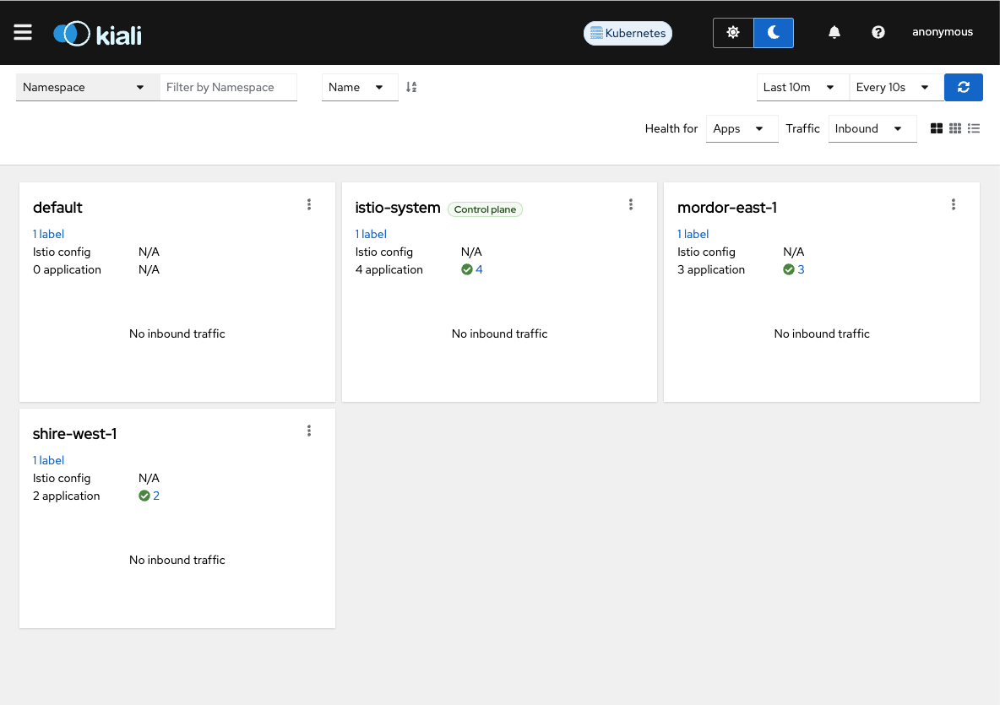
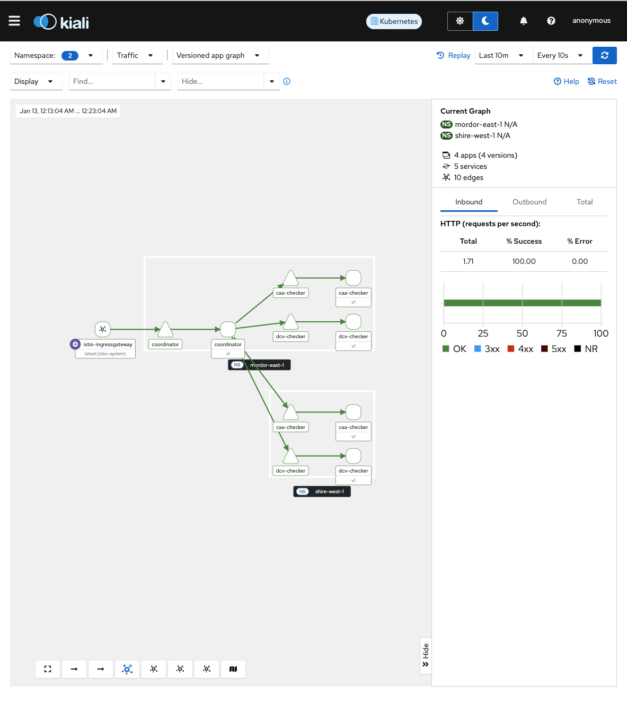

# Kubernetes Cluster Setup on Docker Desktop

This guide provides instructions on setting up a Kubernetes cluster on Docker Desktop and installing Istio with Kiali, Grafana, and Prometheus.
It deploys two imaginary regions for test purposes: `mordor-east-1` and `shire-west-1`.

Also included is a traffic generator to have some traffic to monitor with Kiali.

## Prerequisites

- Docker Desktop installed
- Kubernetes 1.27+ (installed via Docker Desktop)
- Kustomize 4.0+
- Hey 0.1.0+
- Istio 1.24+
- istioctl 1.20+
- jq 1.6+

## Prepare Tools

### 1. Enable Kubernetes in Docker Desktop

1. Open Docker Desktop.
2. Go to Preferences.
3. Select the Kubernetes tab.
4. Check the "Enable Kubernetes" option.
5. Click "Apply & Restart".

### 2. Verify Kubernetes Installation

[Documentation](https://kubernetes.io/docs/tasks/tools/)

```sh
kubectl version --client
kubectl cluster-info
```

### 3. Install Kustomize

[Documentation](https://kubectl.docs.kubernetes.io/installation/kustomize/)

```sh
kustomize version
```

### 4. Install helm

[Documentation](https://helm.sh/docs/intro/install/)

```sh
helm version
```

### 5. Install Istioctl

[Documentation](https://istio.io/latest/docs/ops/diagnostic-tools/istioctl/#install-hahahugoshortcode939s2hbhb)

```sh
# Download the latest release with the following command
curl -sL https://istio.io/downloadIstioctl | sh -

# Add the istioctl client to your PATH
export PATH=$HOME/.istioctl/bin:$PATH
```

### 6. Install Hey

[Documentation](https://github.com/rakyll/hey?tab=readme-ov-file#installation)

```sh
hey
```

### 7. Install jq

[Documentation](https://jqlang.github.io/jq/download/)

```sh
jq --version
```

## Configure Cluster

### 1. Run Cluster Script

This script will install

- istio
- grafana
- prometheus
- kiali

```sh
cd deployment-examples/kubernetes/scripts
sh setup-cluster.sh create
```

### 2. Launch Kiali Dashboard


```sh
$ istioctl dashboard kiali
http://localhost:20001/kiali
```



### 3. Generate Traffic

```sh
cd deployment-examples/kubernetes/scripts
sh generate-traffic.sh
```

### 4. View Kiali Traffic Graph

Open the hamburger menu and select "Traffic Graph" to see the traffic between the services. Select the "mordor-east-1" and "shire-west-1" namespaces to see the traffic between the regions.

